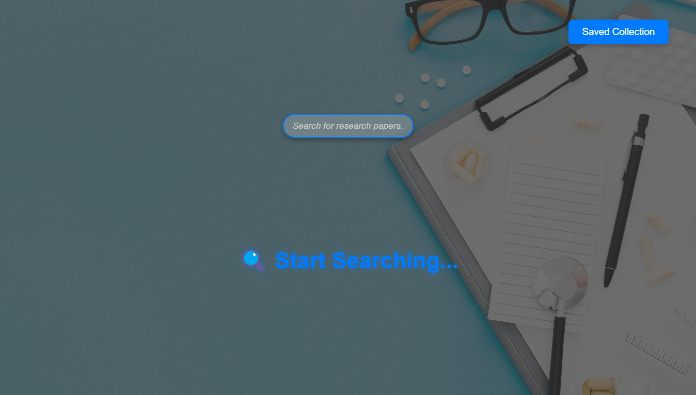
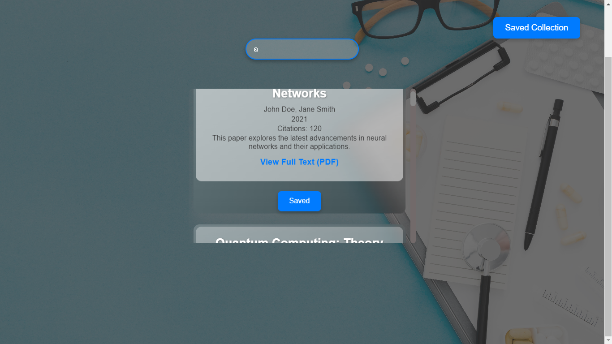
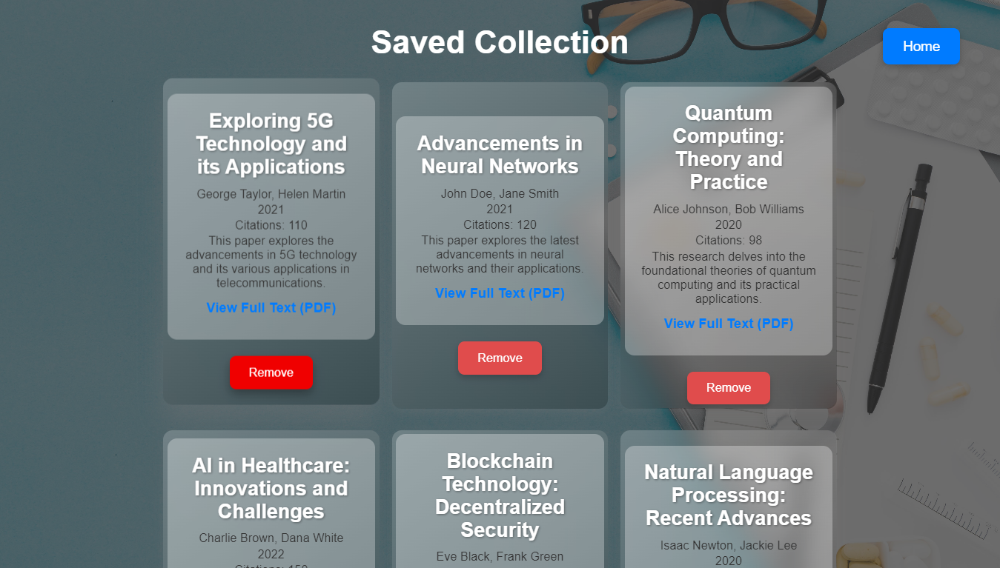

# Research Paper Search App

## Description

The Research Paper Search App allows users to search for research papers, view results, and save papers to a personal collection. It features a clean and responsive user interface with advanced search functionality.

1. ***Search Page***

2. ***Instant-Search***

3. ***Saved-Collection***


## Project Structure

- `src/` - Contains the React-based frontend application.
- `backend/` - Contains the Node.js and Express-based backend server.

## Setup Instructions

1.**Clone the repository:**

```bash
git clone https://github.com/ShailendraSingh19/research-paper-search-app.git
```
```bash
cd research-paper-search-app
```
2.**Install dependencies:**

For the frontend:
```bash
    npm install
```
For the backend:
```bash
    cd backend
```
 ```bash
    npm install
```


3.**Running the Application**

##### Backend:
Open a terminal and navigate to the backend directory:
```bash
cd backend
```
Start the backend server:
```bash
nodemon index.js
```
###### Note: nodemon is not installed by default. Install it globally using 
```bash
npm install -g nodemon
```
or
###### Alternatively, you can start the server using:
```bash
node index.js
```
The backend server will be available at http://localhost:5000.

##### Frontend
Open a new terminal and navigate to the parent directory:
Start the frontend application:
```bash
npm start
```
The frontend application will open in your default browser at http://localhost:3000.

##### Usage:
Search for Papers: Use the search bar on the homepage to find research papers.
View Results: Results will be displayed in a scrollable container.
Save Papers: Click the save button on each result to add it to your personal collection. Access saved papers via the "Saved Collection" button.
